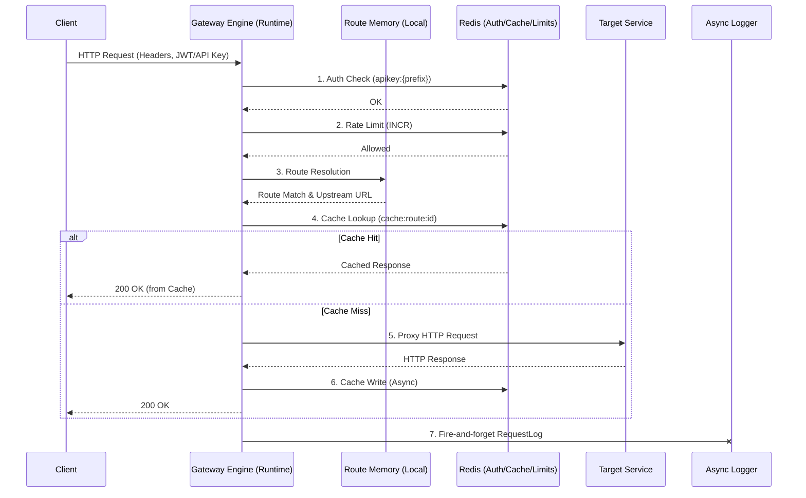

# Runtime Execution Contract

## 1. Full Request Lifecycle Pipeline
1. **Authentication**: Gateway извлекает credentials (`X-API-Key` или JWT `Authorization`). Сверяет их с In-Memory кэшем или Redis (для API Key) / валидирует сигнатуру (для JWT).
2. **Rate Limiting**: Если аутентификация успешна, Gateway выполняет атомарный `INCR` счетчика в Redis. Если лимит превышен — отдает `429 Too Many Requests`.
3. **Routing**: Поиск совпадения `(Method, Path)` в in-memory дереве маршрутов. Определение `Service` и целевого `base_url`.
4. **Caching (Read)**: Если для `Route` включен кэш, Gateway проверяет Redis на наличие готового ответа. При попадании — немедленный возврат ответа клиенту (Cache Hit).
5. **Proxying**: Формирование upstream-запроса, проксирование HTTP-вызова на целевой `Service`, обработка таймаутов и статусов ответа.
6. **Caching (Write)**: При успешном ответе (200-299) и включенном кэшировании — асинхронная запись ответа в Redis с заданным TTL.
7. **Logging**: Асинхронная передача агрегированных метаданных (статус, latency, size, api_key_id) в шину (или асинхронный воркер) для вставки в PostgreSQL `request_logs`.

---

## 2. Strict Execution Order (MUST BE FIXED)
Конвейер (Pipeline) строго последователен и прерывается при первой ошибке (Fail-Fast):
`WAF / IP Filter` ➔ `Authentication` ➔ `Rate Limiting` ➔ `Routing` ➔ `Cache Read` ➔ `Proxy (Upstream)` ➔ `Cache Write (Async)` ➔ `Logging (Async)`.

*Ни один слой не может обойти предыдущий. Proxying никогда не начнется без успешного Rate Limiting и Routing.*

---

## 3. Redis Data Structures
- **Rate Limit Keys**: 
  - Структура: `String (Counter)`
  - Ключ: `rate_limit:{api_key_prefix}:{YYYYMMDDHHMM}`
  - Операция: `INCR` + `EXPIRE`
- **Cache Keys**:
  - Структура: `String (JSON / Serialized Response)`
  - Ключ: `cache:route:{route_id}:{hash(method_path_query_headers)}`
- **API Key Lookup Cache**:
  - Структура: `Hash` или `String`
  - Ключ: `apikey:{key_prefix}`

---

## 4. Cache Invalidation Rules
- **On Service Update/Delete**: Сброс всех кэшей, относящихся к сервису. Удаляются все ключи по паттерну `cache:route:*` для маршрутов, привязанных к `service_id`.
- **On Route Update/Delete**: Сброс ответов только для данного маршрута. Удаляются ключи по паттерну `cache:route:{route_id}:*`.
- **On API Key Revoke/Delete**: Сброс ключа `apikey:{key_prefix}`. Кэш ответов маршрутов при этом **не очищается**, так как он изолирован от аутентификации.

---

## 5. Timeout Model
- **Per Request Budget**: Максимальный общий бюджет времени на обработку запроса внутри Gateway (без учета ожидания Upstream) < **10ms**.
- **Upstream Timeout Rules**:
  - `Connect Timeout`: 3 секунды (на установку TCP/TLS соединения с Upstream).
  - `Read Timeout`: настраивается на уровне Route, по умолчанию 15 секунд (ожидание TTFB от Upstream).
  - Превышение таймаута ведет к `504 Gateway Timeout`.

---

## 6. Failure Strategy
- **Service Down (Upstream 5xx/Timeout)**: Gateway отдает `502 Bad Gateway` / `504 Gateway Timeout` (Fail-Close для клиента).
- **Cache Miss**: Gateway прозрачно переходит к шагу Proxying.
- **Redis Failure (Rate Limiting/Caching)**: Если Redis недоступен, Gateway переходит в режим **Fail-Open** для Rate Limiting (пропускает запросы, чтобы не класть систему из-за отказа вспомогательной БД) и обходит кэш, идя напрямую в Upstream.

---

## 7. Consistency Model
- **Route / Service Configurations (Memory vs DB)**: **Eventual Consistency**. Изменения в БД применяются к памяти Gateway Runtime с задержкой (обычно < 100ms) через механизмы Pub/Sub или Polling.
- **Cache**: **Eventual Consistency**. Ответы кэшируются с TTL. При инвалидации через Control Plane консистентность восстанавливается.
- **Logs**: **Eventual Consistency**. Логи собираются асинхронно, сброс в PostgreSQL происходит пачками (batching).

---

## 8. Runtime vs Control Plane Separation
- **Explicit Boundary**: 
  - Control Plane (Django API) имеет монопольное право на запись в конфигурационные таблицы (Services, Routes, ApiKeys).
  - Runtime Plane (Gateway Engine) является **strictly read-only** по отношению к конфигурации. Он не делает SQL-запросов во время HTTP-пайплайна.
  - Взаимодействие только однонаправленное: Control Plane ➔ (Pub/Sub) ➔ Runtime Plane.

---

## 9. Performance Assumptions
- **Expected RPS**: Базовая архитектура рассчитывается на `> 5 000 RPS` на один узел Data Plane при I/O bound нагрузке.
- **Latency Targets**: Оверхед Gateway (разбор заголовков, Auth, Redis Rate Limit, Routing) должен составлять `< 5ms` на 99-м перцентиле (p99).

---

## 10. Final Gateway Execution Diagram

---

## Architecture Decisions (ADR v2)

1. **ADR-006: Redis as the Sole Dependency in Hot Path**
   - *Решение*: Вся база для принятия решений (авторизация ключей, лимиты, кэш) вынесена в Redis и локальную память. SQL-база данных (PostgreSQL) полностью исключена из критического пути HTTP.
2. **ADR-007: Fail-Open Resilience for Redis**
   - *Решение*: В случае сетевой изоляции или падения Redis, Gateway обязан игнорировать ошибки лимитирования и кэша, проксируя трафик на Upstream. Главная цель — доступность.
3. **ADR-008: Async Logging**
   - *Решение*: Запись метрик и логов в БД происходит исключительно вне request-response цикла, с использованием буферизации.

## Risks before proxy implementation
- **Memory Leaks in Route Tree**: Хранение всех конфигураций в In-Memory требует жесткого контроля за сборщиком мусора при горячей перезагрузке маршрутов.
- **Cache Stampede (Thundering Herd)**: При истечении TTL высоконагруженного маршрута множество конкурентных запросов одновременно получат Cache Miss и отправятся в Upstream. Требуется механизм Request Collapsing (Promise caching).
- **Socket Exhaustion**: При высокой нагрузке и долгих ответах Upstream Gateway может исчерпать файловые дескрипторы или TCP-порты (TIME_WAIT). Потребуется настройка Connection Pooling для прокси.
